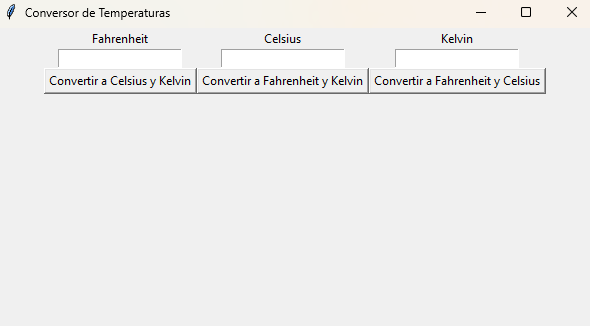

# Conversor de Temperaturas

Este es un programa simple de **Conversor de Temperaturas** que permite convertir entre tres unidades de temperatura: **Fahrenheit**, **Celsius** y **Kelvin**. La interfaz gráfica está creada utilizando **Tkinter** en **Python**. El usuario puede ingresar la temperatura en cualquiera de las tres unidades y el programa mostrará las conversiones correspondientes en las otras dos unidades.

<p align="center">  </p>

## Características

- Convierte entre **Fahrenheit**, **Celsius** y **Kelvin**.
- Permite la conversión de una unidad a las otras dos.
- Interfaz gráfica simple y fácil de usar creada con **Tkinter**.
- Manejo de errores: si el usuario ingresa un valor no numérico, se muestra un mensaje indicando que debe ingresar un número válido.

## Requisitos

- Python 3.x
- Tkinter (generalmente viene preinstalado con Python)

## Instrucciones de Uso

1. **Instalación**: Asegúrate de tener **Python 3.x** instalado en tu sistema. Si no tienes Tkinter, instálalo utilizando el siguiente comando (en caso de que no esté preinstalado):

   ```bash
   pip install tk
